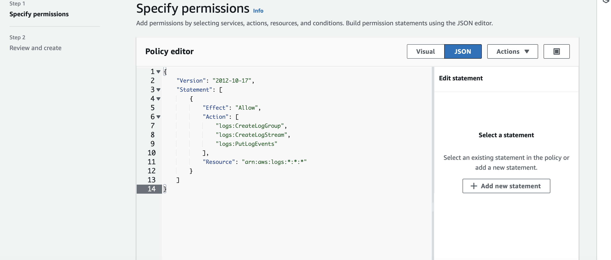

Cloud Nine Airlines Serverless Flight Status Application

Welcome to another Cloud Nine Airlines Project! In this project, we’ll implement a serverless application using S3, API Gateway, Lambda, Step Functions, and SES to send flight status notifications to Cloud Nine Airlines customers. Users can access a static website, fill out a form with their email, flight number, travel date, and a wait time. After submitting, they’ll receive an email with the flight status. This project demonstrates the integration and orchestration of AWS services in a real-world scenario.

Step 1: Configure SES to Verify Email Addresses
Purpose: To set up email functionality, enabling flight status updates to be sent to customers.

Access SES: Log into the AWS Console, navigate to SES, and select Verified Identities.
Create Verified Identities:
Click Create Identity and select Email Address.
Enter your sending and customer test email addresses (these will both need to be verified).
Follow the email verification link sent to your provided address.
Verify Successful Setup: Return to the SES Console, refresh the page, and confirm both emails are verified.

Step 2: Create IAM Role and Lambda Function for Email Notifications
Purpose: Set up Lambda with permissions to interact with SES for sending email notifications.

Part A: Create Lambda IAM Role
Navigate to IAM Console: Search for IAM in the AWS Console.
Create Role:
Select Lambda as the service.
Name the role snsstatesescw and click Create Role.

Add Permissions:
Attach JSON policies for SES and CloudWatch access:
Create an inline policy for SES with the necessary permissions.
Repeat for CloudWatch, enabling Lambda logging.

Part B: Develop Lambda Function for Email
Go to Lambda: Create a new Lambda function with the name cnemailreminder.
Set Role: Assign the role snsstatesescw to this function.
Add Code: Copy the cnemailreminder.py code (ensuring you replace REPLACE_ME with the verified SES email).
Deploy and Test: Deploy the function to finalize configuration.
This function is invoked to send customized flight notifications via SES, using details supplied by Step Functions.
Overview of cnemailreminder.py (Lambda Function for SES Email Sending)

Purpose: Sends an email via SES, notifying users about their flight status.
Intent: This function reinforces customer service by providing real-time flight updates.
Code Breakdown:

Import Statements: boto3 (AWS SDK) for SES, json for data handling.
SES Client Setup: ses_client = boto3.client('ses') establishes the SES client to handle email sending.
Lambda Handler:
Constructs the email using event data (flight info, recipient email).
Calls ses_client.send_email() to send the notification.
Error Handling: Ensures resilient email sending and logs any SES errors.
Logic:
Formatting: Email content is structured to highlight flight details.
SES Call: The function interacts with SES to send emails efficiently.
Exception Handling: Manages potential SES issues, enhancing reliability.
With this function, users receive timely flight reminders, enhancing the customer experience for Cloud Nine Airlines.

Step 3: Configure IAM Role and Step Functions State Machine
Purpose: Establish the Step Functions state machine to control application workflow, including timed email notifications.

Part A: Create State Machine IAM Role
IAM Console: Return to IAM and create a role for Step Functions.
Permissions:
Add permissions for Step Functions to invoke Lambda.
Add CloudWatch logging permissions to monitor the state machine.
Name the role statemachinerole.

Part B: Build Step Functions State Machine
Access Step Functions: Create a new state machine with a blank template.
Define Logic:
Copy the code from cnstatemachine.json.
Replace EMAIL_LAMBDA_ARN with the ARN of the cnemailreminder Lambda function.
Configure and Deploy:
Name the state machine cnstatemachine, select the statemachinerole, and enable detailed CloudWatch logging.
Save the ARN for this state machine for future steps.
This controls the flow of notifications, coordinating between AWS services to ensure timely communication with users.

Overview of State Machine Logic:

Purpose: Controls the end-to-end flow, handling timing and invoking services as needed.
Intent: Ensures that reminders are sent after a specified delay.
Steps: Waits for the delay specified by the user, then invokes cnemailreminder to send the email.

Step 4: Configure API Lambda and API Gateway
Purpose: Establish the API endpoint to receive data from users, triggering Lambda to start the notification workflow.

Part A: API Lambda Setup
Create Function: Create api_lambda function in Lambda with role snsstatesescw.
Add Code: Copy api_lambda.py code into the function editor.
Deploy: Deploy the function.
Overview of api_lambda.py: This function acts as the backend, handling customer data input and triggering the state machine.

Part B: API Gateway
Create REST API in API Gateway to interact with api_lambda.
Configure Resources and Methods:
Set up necessary endpoints and map them to the api_lambda function.
Deploy API: Deploy the API, enabling public access to the frontend application.
Overview of api_lambda.py (AWS Lambda Function for API Gateway Integration)

Purpose: Acts as the entry point for the serverless application.
Intent: Handles and validates incoming data, triggers the Step Function workflow.
Code Breakdown:

Imports: json, boto3, ClientError.
Lambda Handler:
Validates input fields (email, flight number, etc.).
Trigger State Machine: Calls Step Functions to initiate the reminder workflow.
Error Handling: Manages issues with data validation or Step Function invocation.

Step 5: Create S3 Static Website
Purpose: Host the Cloud Nine Airlines frontend where users will input their flight and contact information.

Set Up S3 Bucket: Create a bucket to store and serve static website content.
Enable Static Website Hosting: Configure the bucket for website hosting.
Upload Website Files: Upload HTML, CSS, and JavaScript files to the bucket.
Set Bucket Permissions: Adjust bucket policies to allow public access to website resources.
Overview of Website: This static website serves as the interface for customers to request flight status updates.
Overview of index.html (Static HTML Form)

Purpose: Provides a user-friendly interface for customers to enter their flight details.
Intent: Simplifies data input for customers to request flight status reminders.

Code Breakdown:

HTML Structure:
Form fields for email, flight number, date of travel, and wait seconds.
Submit Button: When clicked, the form sends data to the API Gateway endpoint.
JavaScript:
Handles form submission and data validation.
Uses fetch to send data as a JSON payload to the API Gateway endpoint.
CSS Styling:
Ensures a clean, airline-branded look for Cloud Nine Airlines.
Responsive design to support various devices.
The HTML, JavaScript, and CSS work together to provide a smooth user experience, while the form submission triggers the API Gateway integration with the serverless backend.

Step 6: Test and Monitor Application
Purpose: Ensure functionality and troubleshoot any issues.

Test Workflow: Open the website, submit a flight status request, and verify that notifications are sent as expected.
Monitor Logs: Use CloudWatch Logs to track Lambda execution and Step Functions flow.
Confirm SES Delivery: Ensure SES successfully sends emails.

This project showcases the complete architecture of a serverless application, highlighting proficiency with AWS services, IAM policies, and step-by-step integration for a professional customer experience.